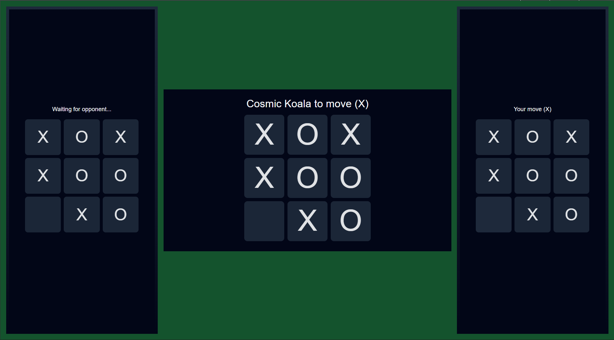

# 🎲 Creating a Tardi Game 👾

Hi! You can create your own Tardi games!

If you haven't played some games on [tardi.games](tardi.games) yet, go there now and play a few. Your life as a Tardi game developer will be much easier. 😉


## Basic Concepts

A Tardi game is a turn-based or light-action game. Avoid heavy action, for a better player experience.

- **Tardi** - The tardi.games platform, where your game will run.
- **Table** - The part of your game that runs on a big TV or similar device, visible to everyone in the room. The "Table" is a view-only display. Users do not interact with it.
- **Hand** - The part of your game that runs on a player's handheld device, like a phone or tablet. The "Hand" is the player's game controller.

Tardi makes it easy for the Table and Hand parts of your game to send messages to each other (see below).


## Creating a Game

#### 1) Fork this repo

[Fork this repo](https://github.com/juxhouse/tardi.games/fork) to your account.

> [!IMPORTANT]
> Do not rename the repo. It must be called `{your-account}/tardi.games`.

Clone it locally.


#### 2) Rename the example game

Inside `games`, rename the `tic-tac-toe` folder to the name of your game. Use only lowercase a-z, digits and dashes.

Edit the `game.json` file to set your new title, description and number of players.


#### 3) Code It

Inside the game folder, install the dependencies. Run:

```
npm update @juxhouse/tardi-build @juxhouse/tardi-sdk
npm i
```

Use your coding agent to make the game the way you want it.

To play it in dev mode:

`npm run dev`



Dev mode will open your game Table with 2 Hands already connected.


#### 4) Release It!

Inside the game folder, run:

`npm run build`

Commit the generated files to the `main` branch and push to Github. Make sure your repo is called `tardi.games`.

The Tardi platform will automatically detect your changes and release the new version. This takes a couple of minutes.


#### 5) Play with your friends

When choosing a game to play on [tardi.games](https://tardi.games) you can search for your github account and/or game name.

Call your friends! Have fun!


## Limits

You can create as many games as you like in the `games` folder. Just copy the first one and rename it.

Each game can have 100 files max. If you have more than 100 images or sounds, for examples, ask your agent: "URL-encode these images/sounds/clips using base64.".

Each file can be 25MB max.
